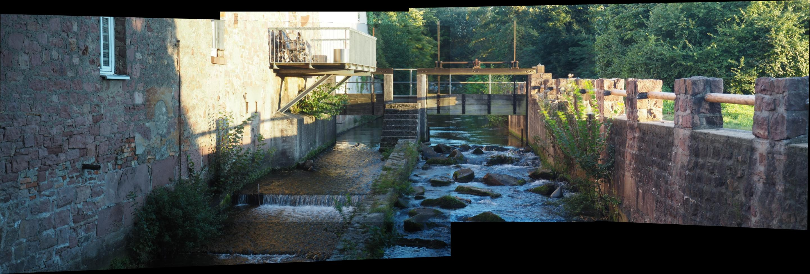
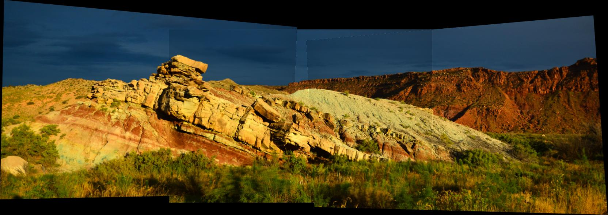

# Computer Vision

Three projects covering classical computer vision: color channel alignment and demosaicing, projective geometry with image denoising, and automatic panorama stitching.

## Projects

 **Note:** The notebook files are too large for GitHub's online renderer. Use the PDF links to view the full output with visualizations, or clone the repo and open the notebooks locally.

### 1. Color Alignment & Demosaicing ([pdf](color-alignment/color_alignment.pdf) | [notebook](color-alignment/color_alignment.ipynb))

Alignment and reconstruction of color images from separated or mosaiced channels.

- ZNCC-based brute-force alignment of misaligned RGB channels
- Application to historical Prokudin-Gorskii photograph set
- Bayer demosaicing via bilinear interpolation with custom convolution kernels
- Freeman method demosaicing using G-channel guided median filtering

### 2. Geometry, Homography & Denoising ([pdf](geometry-denoising/geometry_denoising.pdf) | [notebook](geometry-denoising/geometry_denoising.ipynb))

Projective geometry tools and non-local means denoising with both classical and neural approaches.

- Least-squares vanishing point estimation from annotated line segments
- Homography computation and image rectification (both via cv2 and manual implementation)
- Non-Local Means denoising with integral image acceleration
- Neural NLM using pretrained ResNet features as patch descriptors
- Systematic hyperparameter search across four noise regimes (Gaussian and salt & pepper)

### 3. Panorama Stitching ([pdf](panorama-stitching/panorama_stitching.pdf) | [notebook](panorama-stitching/panorama_stitching.ipynb))

Automatic panorama construction from multiple overlapping images.

- SIFT keypoint detection and descriptor extraction
- Brute-force matching with Lowe's ratio test for correspondence filtering
- RANSAC homography estimation with threshold sensitivity analysis
- Perspective warping and mask-based blending

#### Results (Panorama)

| Image Set 1 | Image Set 2 |
|---|---|
|  |  |

## Requirements

```
pip install -r requirements.txt
```
